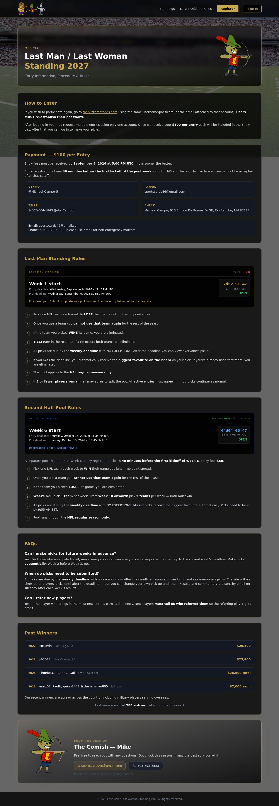

# How to create a new contact on your account

This guide walks users through adding a new contact from the account area.

## Live page reference

The public rules page was opened and captured from the live site at https://theblizzardofodds.com/dashboard/rules.

## Steps to create a new contact

1. Sign in to your account.
   - Go to the main dashboard and log in with your username and password.

2. Open the account or profile area.
   - From the dashboard navigation, select the section that contains your contacts, people, or account details.

3. Click the New Contact button.
   - Look for a button such as Add Contact, New Contact, + New Contact, or Create Contact.

4. Fill in the contact details.
   - Enter the contact's first and last name.
   - Add their email address and phone number if available.
   - Complete any required fields marked with an asterisk.

5. Save the new contact.
   - Click Save, Create Contact, or Add.
   - Wait for the confirmation message or for the new contact to appear in the list.

6. Confirm the contact was added.
   - Return to the contacts list and confirm the new entry appears.

## Troubleshooting

- If you do not see a Contacts section, check your permissions or the name of the menu.
- If the Save button is disabled, complete all required fields.
- If the contact does not appear after saving, refresh the page and check again.

## Support copy

"To create a new contact on your account, sign in to the dashboard, open the contacts or account section, click New Contact, enter the required details, and save. Once the contact is added, it should appear in your list immediately. If you cannot see the option, check your permissions or refresh the page."
